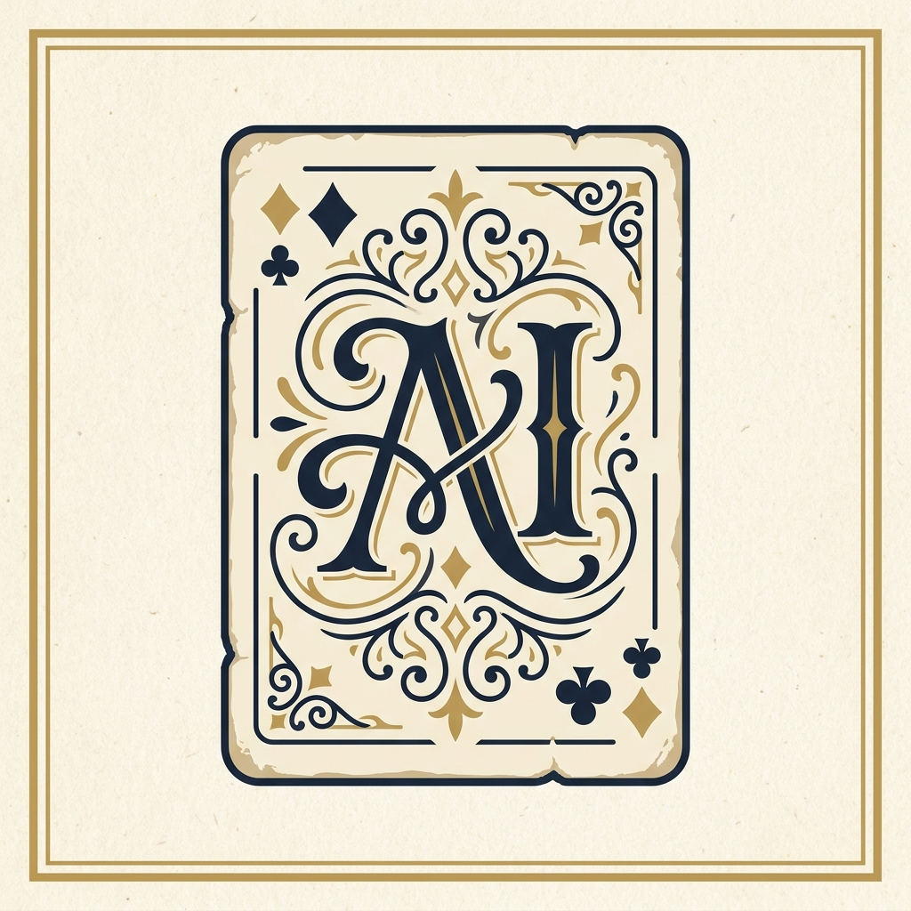

# AI Companion Board Game

<div align="center">
  
  <h3>Play Werewolf with AI — a full table, no party required</h3>
  <p>
    <a href="https://github.com/jim6642/ai-companion-board-game">Play Online (https://github.com/jim6642/ai-companion-board-game)</a>
  </p>
</div>

## 🙏 Sponsors


Current sponsors:

*   [TokenDance](https://tokendance.agent-universe.cn/) - Powers the core game flow, roleplay, and summary features
*   [Dashscope](https://bailian.console.aliyun.com/) - Provides AI capability support
*   [MiniMax](https://api.minimaxi.com/) - Chat + TTS for the companion characters
*   [SiliconFlow](https://siliconflow.cn/) - STT

---

## 📖 Background

After graduating, getting 8-12 people together for a proper Werewolf game became nearly impossible. While Werewolf is fundamentally a social game, its core appeal — logical deduction, verbal sparring, and reading between the lines — remains captivating even without the social element.

To enjoy Werewolf anytime, anywhere, we built this **AI-powered version**. As the name suggests, every player except you (Seer, Witch, Hunter, Guard, Werewolves, etc.) is controlled by AI.

## ✨ Core Features

### 1. Dual-Layer AI Roleplay
Thanks to the growing context windows and instruction-following capabilities of large language models (LLMs), we've implemented a sophisticated dual-layer roleplay system:
*   **Layer 1**: The AI plays a "virtual player" with a unique personality and background.
*   **Layer 2**: This virtual player then takes on a Werewolf role (e.g., Seer) and speaks, bluffs, and reasons based on the game state.

Every conversation is generated in real-time, full of unpredictability and fun.

### 2. AI Opponents That Actually Play
**This is Werewolf you can play alone, with a full table of AI players.**

Each AI player has a stable personality, role perspective, memory, and faction goal. They follow speeches, vote history, deaths, and pressure at the table, then decide whether to accuse, defend, bluff, follow, or hold back.

### 3. Immersive Retro Experience
While we don't have a professional art team, we've crafted a polished UI/UX:
*   **Retro Design Style**: Clean layouts with vintage color palettes.
*   **Dynamic Interactions**:
    *   Eye-blink transitions for day/night changes.
    *   Character lip-sync animations during speech.
    *   Unique character portraits for special roles during night actions.

## 🧭 Roadmap

We're continuing to improve:
*   **Mobile Optimization**: Play seamlessly on any device.
*   **Flexible Player Count**: Support 8-12 player custom games.
*   **Post-Game Review / Chat**: Reflect on strategies and memorable moments.
*   **Special Abilities**: Unique mechanics like time rewind and AI insight.
*   **Smarter AI Players**: Richer memory, stronger bluffing, and more varied table behavior.

## 🎴 Companion-mode board games

In addition to the full Werewolf flow above, `/companion` now hosts six smaller table games that share the same 7 AI characters and the same chat / TTS / STT pipeline:

| Game | Players | You do | AI does |
| --- | --- | --- | --- |
| Werewolf | 8 | night actions → speech → vote → next round | hidden role + stable personality; accuse, rebut, follow votes, bluff |
| Liars Dice | 5 (you + 4) | bid the next quantity/face, or call the previous bidder | local engine for hidden dice + legal bids + reveal |
| Love Letter | 4 (you + 3) | draw 1 → play 1 → resolve effect | all 8 card kinds resolved locally |
| Aeroplane (Aeroplane Chess) | 4 (you + 3) | roll dice → fly home → take shortcuts | dice + AI decisions fully local |
| UNO | 8 | play / draw / take +2 / challenge +4 | 8 AI personalities, real-time call-UNO logic |
| **Exploding Kittens** | 2-5 (you + 1-4) | play action cards or draw; draw the kitten without a defuse and you explode | classic 54-card deck (defuse / attack / see-future / shuffle / skip / nope / favor / 5 cat types) resolved by a local engine |
*   **Multiplayer Mode**: Play with friends alongside AI characters.
*   **Character Ratings**: Upvote standout AI personalities to find the most convincing Werewolf players.

## 🛠️ Tech Stack

Built with modern web technologies:

*   **Framework**: [Next.js 16](https://nextjs.org/) (App Router)
*   **Language**: [TypeScript](https://www.typescriptlang.org/)
*   **Styling**: [Tailwind CSS 4](https://tailwindcss.com/)
*   **UI Components**: [Radix UI](https://www.radix-ui.com/), [Lucide React](https://lucide.dev/)
*   **State Management**: [Jotai](https://jotai.org/) 
*   **Editor**: [Tiptap](https://tiptap.dev/) (For rich text interactions)
*   **Animations**: [Framer Motion](https://www.framer.com/motion/)
*   **Avatar Generation**: [DiceBear](https://www.dicebear.com/) (Notionists style)
*   **AI Integration**: [TokenDance](https://tokendance.agent-universe.cn/) (Unified interface for LLMs)

## 🚀 Local Development

To run this project locally:

1.  **Clone the repository**

```bash
git clone https://github.com/jim6642/ai-companion-board-game.git
cd ai-companion-board-game
```

2.  **Install dependencies**

```bash
# Using pnpm (recommended)
pnpm install

# Or using npm
npm install
```

3.  **Configure environment variables**

You'll need to set up API keys (TokenDance, etc.) for full functionality. Refer to `.env.example` and create your `.env.local`.

4.  **Start the development server**

```bash
pnpm dev
```

Open [http://localhost:3000](http://localhost:3000) in your browser.

## 📄 License

MIT
