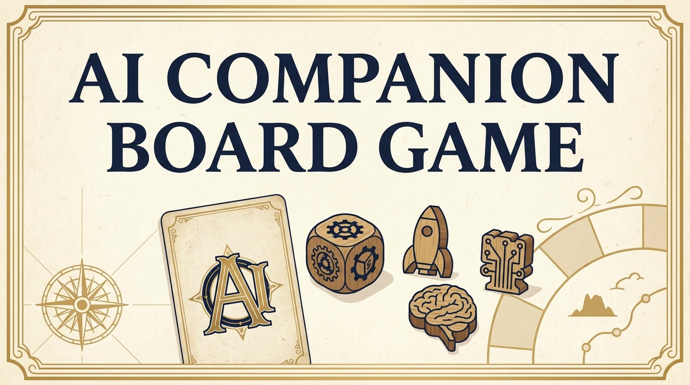

# AI Companion Board Game — AI Board Game Companion

<p align="right"><a href="./README.zh.md">简体中文</a></p>



<p align="center">
  <strong>You take one seat. AI players fill the rest.</strong><br />
  An AI-native companion that plays a full table of social-deduction and
  bluffing board games with you — Werewolf, Liars Dice, Love Letter, and Aeroplane Chess.
</p>

<p align="center">
  <a href="https://github.com/jim6642/ai-companion-board-game"><strong>Play online</strong></a>
  ·
  <a href="#local-development">Run locally</a>
  ·
  <a href="./README.zh.md">中文说明</a>
</p>

## What is this?

AI Companion Board Game is a browser-native collection of classic social and bluffing
board games where every non-human seat is controlled by an LLM. You pick
the game, pick the AI companions, and the rest of the table plays,
bluffs, and reacts around a fully local rule engine. The model is
never a referee — it only chats about the publicly visible state.

| Game | Players | What you do | How AI fits in |
| --- | --- | --- | --- |
| **Werewolf** (`/zh/companion/werewolf`) | 8 | Night actions → speeches → vote → repeat | Each AI holds a hidden role + a stable personality; accuses, defends, bluffs, follows. |
| **Liars Dice** (`/zh/companion/liars-dice`) | 5 (you + 4 AI) | Bid the next quantity of a face, or call the previous bidder | AI bots estimate probability from the public bid history and their own hidden dice; you can challenge or outbid. |
| **Love Letter** (`/zh/companion/love-letter`) | 4 (you + 3 AI) | Draw → play a card → resolve its effect (guard, priest, baron, handmaid, prince, king, countess, princess) | AI plays the game locally; reacts to revealed events in chat. |
| **Aeroplane Chess** (`/zh/companion/aeroplane`) | 4 (you + 3 AI) | Roll dice, fly tokens home, take shortcuts | AI rolls and moves locally; the model only reacts to public events. |

All four games share the same 7-character cast (`温婉` / `沈棠` / `凌雪` / `苏念` / `陆野` / `程悦` / `傅宁`) and the same companion chat / TTS / STT pipeline; each game has its own rule engine, prompt set, and round cadence.

## How the AI is wired

- **Local rules, public state only.** Every move, draw, dice roll, and
  win check is computed in the browser by a pure TypeScript engine. The
  model never sees hidden cards or dice; the prompt explicitly forbids it
  from claiming otherwise.
- **Per-character memory.** Each AI carries a small `warmth / rivalry /
  callback` memory across rounds in the same match (you can read the
  full design in [`COMPANION.md`](./COMPANION.md)).
- **One chat pipeline, four games.** `/api/companion/respond` dispatches
  by `mode` (`werewolf` / `liars-dice` / `love-letter` / `aeroplane`),
  so a single LLM call serves all four games with a mode-specific system
  prompt and a per-character cue.
- **TTS + STT.** MiniMax TTS plays each line sequentially (queue-based,
  no overlap); SiliconFlow STT fills the chat input on mobile.
- **Streaming UI.** All four game UIs are fixed-height, side-by-side
  board + chat, so the page does not grow with chat history.

## Latest engineering work

- **Chat / voice queue draining fix** — across all four companion games,
  the `reactionQueueRef` / `voiceQueueRef` / `pendingVoiceCountRef` now
  get a `matchId` bump and explicit reset on every `startGame` /
  `restart` / companion switch. Long games no longer leak an
  in-flight `/api/companion/respond` reply from the previous match
  into the new one. Regression tests under `scripts/qa-*-queue-drain.mjs`
  (with `qa-queue-drain-helper.mjs` as the shared CDP harness) verify
  this with a parked-fetch stub and a negative-control revert.
- **Middleware proxy opt-in** — `src/middleware.ts` no longer silently
  rewrites `/api/*` to `http://localhost:3000` when the dev server is
  on `:3001`. The proxy is now strictly opt-in via
  `LOCAL_API_PROXY_BASE_URL`; a `resolveLocalApiProxyOrigin` helper
  guards against non-`http(s)` values. Covered by
  `scripts/test-middleware-proxy.mts`.

## Tech stack

- [Next.js 16](https://nextjs.org/) (App Router) · [React 19](https://react.dev/)
- [TypeScript 5](https://www.typescriptlang.org/) (strict) · Node ≥ 22
- [Tailwind CSS 4](https://tailwindcss.com/) · CSS Modules per game
- [Jotai](https://jotai.org/) for shared state, `useState` + refs for game state
- [Radix UI](https://www.radix-ui.com/) primitives, [Phosphor Icons](https://phosphoricons.com/)
- [Framer Motion](https://www.framer.com/) for transitions
- MiniMax for chat + TTS, SiliconFlow for STT, ZenMux / DashScope / NewAPI as routing options
- `node --test` + CDP-driven Edge harness for regression tests, no extra test framework

## Local development

Requirements: Node ≥ 22 and [pnpm](https://pnpm.io/).

```bash
git clone https://github.com/jim6642/ai-companion-board-game.git
cd ai-companion-board-game
pnpm install
cp .env.example .env.local
# Fill in ZENMUX_API_KEY / MINIMAX_API_KEY / MINIMAX_GROUP_ID at minimum
pnpm dev          # http://localhost:3000
# Or
pnpm start        # production build (needs `pnpm build` first)
```

Game URLs (dev port defaults to 3000; the project also runs on 3001
via `scripts/site-service.ps1`):
- `/zh/companion/werewolf` — 8-seat Werewolf
- `/zh/companion/liars-dice` — 5-seat Liars Dice
- `/zh/companion/love-letter` — 4-seat Love Letter
- `/zh/companion/aeroplane` — 4-seat Aeroplane Chess

## Tests

```bash
pnpm test                                   # middleware proxy helper
node --experimental-strip-types \
  scripts/qa-liars-dice-engine.mjs          # 5000-game engine sim
node --experimental-strip-types \
  scripts/qa-liars-dice-rules.mjs          # edge cases (1s halve, 1s double+1)
node --experimental-strip-types \
  scripts/qa-liars-dice-queue-drain.mjs     # regression: stale reply leak
node --experimental-strip-types \
  scripts/qa-love-letter-queue-drain.mjs    # same regression
node --experimental-strip-types \
  scripts/qa-aeroplane-queue-drain.mjs      # same regression
```

## Sponsors

- [TokenDance](https://tokendance.agent-universe.cn/) — core game flow, roleplay, and summaries
- [DashScope](https://bailian.console.aliyun.com/) — AI capability support
- [MiniMax](https://api.minimaxi.com/) — chat + TTS for the companion characters
- [SiliconFlow](https://siliconflow.cn/) — STT

## License

[MIT](./LICENSE)
