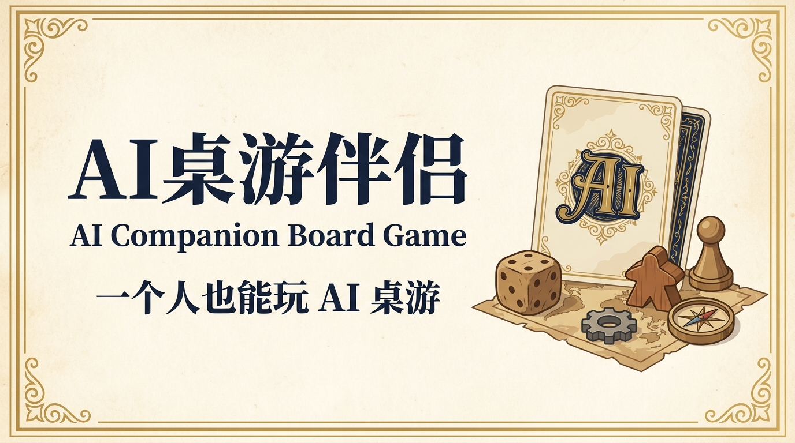

# AI Companion Board Game —— AI 桌游陪伴

<p align="right"><a href="./README.md">English</a></p>



<p align="center">
  <strong>你坐一席，剩下的人交给 AI。</strong><br />
  狼人杀、吹牛骰子、心动密函、飞行棋 —— 浏览器本地规则引擎 + AI 陪玩。
</p>

<p align="center">
  <a href="https://github.com/jim6642/ai-companion-board-game"><strong>在线开局</strong></a>
  ·
  <a href="#本地运行">本地运行</a>
  ·
  <a href="./README.md">English</a>
</p>

## 这是什么？

AI Companion Board Game 是一组在浏览器里就能跑的经典社交 / 伪装类桌游合集，所有非真人席位都由 LLM 控制。你选游戏、选陪玩，剩下的位置由 AI 自动入座、按本地规则引擎打完一整局。模型不是裁判，只对公开事件陪你聊。

| 游戏 | 人数 | 你做什么 | AI 在哪 |
| --- | --- | --- | --- |
| **狼人杀** `/zh/companion/werewolf` | 8 | 夜间行动 → 发言 → 投票 → 下一轮 | 每个 AI 持隐藏身份 + 稳定性格；怀疑、反驳、跟票、装傻 |
| **吹牛骰子** `/zh/companion/liars-dice` | 5（你 + 4 AI）| 叫下一个"多少个几"，或质疑上家 | AI 用公开叫点轨迹 + 自己的隐藏骰子估算胜率，决定跟叫、翻倍还是开盅 |
| **心动密函** `/zh/companion/love-letter` | 4（你 + 3 AI）| 摸一张 → 打出一张 → 触发效果 | 卫兵 / 祭司 / 男爵 / 侍女 / 王子 / 国王 / 伯爵夫人 / 公主，全在本地结算 |
| **飞行棋** `/zh/companion/aeroplane` | 4（你 + 3 AI）| 掷骰子 → 飞飞机回家 → 抄近道 | AI 掷骰、决策、选近道全在本地；模型只对公开事件反应 |

四款游戏共用同一套 7 名陪玩角色（`林夏` / `苏遥` / `顾清岚` / `唐果` / `陈航` / `小满` / `沈宁`）和同一套聊天 / TTS / STT 通道；每款有独立的规则引擎、提示词和回合节奏。

## AI 是怎么接进来的

- **本地规则 + 仅公开状态**。所有走子、抽牌、掷骰、胜负判定都在浏览器端用纯 TypeScript 引擎算完。模型永远看不到对手的隐藏牌 / 骰子；提示词里明确禁止它声称看到。
- **角色级记忆**。每个 AI 在同一局里跨回合带 `warmth / rivalry / callback` 三件小记忆（完整设计见 [`COMPANION.md`](./COMPANION.md)）。
- **一套聊天管四款游戏**。`/api/companion/respond` 按 `mode`（`werewolf` / `liars-dice` / `love-letter` / `aeroplane`）分发，一个 LLM 调用服务四款游戏，配合 mode 专属 system prompt 和角色 cue。
- **TTS + STT**。MiniMax TTS 用全局队列顺序播放，多人连续发言不互相覆盖；硅基流动 STT 给移动端提供按住说话。
- **流式 UI**。四款游戏都是固定一屏的"牌桌 + 聊天"两栏布局，聊天记录不会把页面越拉越长。

## 最近一轮的工程改动

- **聊天 / 语音队列排空**。四款陪伴游戏的 `reactionQueueRef` / `voiceQueueRef` / `pendingVoiceCountRef` 现在都在 `startGame` / `restart` / 换陪玩时拿到一个 `matchId` 自增并显式重置。长局里 bot 一回合的 `/api/companion/respond` 回复不再会漏进下一局。回归测试在 `scripts/qa-*-queue-drain.mjs`，共享 CDP 桩在 `scripts/qa-queue-drain-helper.mjs`，并各自跑过一次正反两路验证。
- **中间件代理改为显式 opt-in**。`src/middleware.ts` 不再在 dev 服务器跑在 `:3001` 时偷偷把所有 `/api/*` 重写到 `http://localhost:3000`。代理现在严格通过环境变量 `LOCAL_API_PROXY_BASE_URL` 显式开启；`resolveLocalApiProxyOrigin` 帮手拒绝非 `http(s)` 值。`scripts/test-middleware-proxy.mts` 覆盖。

## 技术栈

- [Next.js 16](https://nextjs.org/)（App Router）· [React 19](https://react.dev/)
- [TypeScript 5](https://www.typescriptlang.org/)（strict）· Node ≥ 22
- [Tailwind CSS 4](https://tailwindcss.com/) · 每款游戏自己的 CSS Modules
- [Jotai](https://jotai.org/) 共享状态，游戏内部用 `useState` + refs
- [Radix UI](https://www.radix-ui.com/) 原语 · [Phosphor Icons](https://phosphoricons.com/)
- [Framer Motion](https://www.framer.com/) 转场
- MiniMax 提供聊天 + TTS，SiliconFlow 提供 STT，ZenMux / DashScope / NewAPI 做路由
- `node --test` + CDP 驱动的 Edge 测试 harness，不引入额外测试框架

## 本地运行

需要 Node ≥ 22 和 [pnpm](https://pnpm.io/)。

```bash
git clone https://github.com/oil-oil/aicb.git
cd aicb
pnpm install
cp .env.example .env.local
# 至少填 ZENMUX_API_KEY / MINIMAX_API_KEY / MINIMAX_GROUP_ID
pnpm dev          # http://localhost:3000
# 或
pnpm start        # 生产模式（需先 pnpm build）
```

游戏入口（dev 默认 3000；项目也能用 `scripts/site-service.ps1` 跑在 3001）：
- `/zh/companion/werewolf` —— 8 人狼人杀
- `/zh/companion/liars-dice` —— 5 人吹牛骰子
- `/zh/companion/love-letter` —— 4 人心动密函
- `/zh/companion/aeroplane` —— 4 人飞行棋

## 测试

```bash
pnpm test                                   # 中间件代理帮手
node --experimental-strip-types \
  scripts/qa-liars-dice-engine.mjs          # 5000 局引擎模拟
node --experimental-strip-types \
  scripts/qa-liars-dice-rules.mjs          # 边界用例（叫 1 点减半 / 转回翻倍加一）
node --experimental-strip-types \
  scripts/qa-liars-dice-queue-drain.mjs     # 回归：旧一局回复漏进新一局
node --experimental-strip-types \
  scripts/qa-love-letter-queue-drain.mjs    # 同上
node --experimental-strip-types \
  scripts/qa-aeroplane-queue-drain.mjs      # 同上
```

## 项目由来

AI Companion Board Game 诞生于 **观猹 × 魔搭环球黑客松**。名字由 **Wolf（狼人杀）** 和 **Cha（猹）** 组成：既在桌上参与推理，也像观众一样看一群 AI 人格互相碰撞。陪伴游戏（吹牛骰子 / 心动密函 / 飞行棋）把"一个人 + 一桌子性格"这个设定延伸到更短、更轻的伪装类玩法。

## 感谢赞助

- [TokenDance](https://tokendance.agent-universe.cn/) —— 提供核心游戏流程、角色扮演和总结能力
- [百炼 DashScope](https://bailian.console.aliyun.com/) —— 提供 AI 能力支持
- [观猹](https://watcha.cn/) —— 提供 AI 能力与展示平台支持
- [MiniMax](https://api.minimaxi.com/) —— 角色聊天 + 语音合成
- [硅基流动](https://siliconflow.cn/) —— 语音识别

## License

[MIT](./LICENSE)
